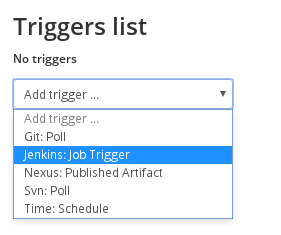
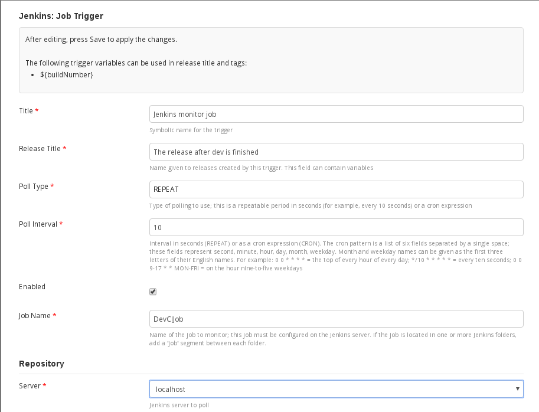

# xlr-jenkins2-plugin

This plugin offers an interface from XL Release to Jenkins 2.x. 

# CI status #

[![Build Status][xlr-jenkins2-plugin-travis-image]][xlr-jenkins2-plugin-travis-url]
[![Codacy Badge][xlr-jenkins2-plugin-codacy-image] ][xlr-jenkins2-plugin-codacy-url]
[![Code Climate][xlr-jenkins2-plugin-code-climate-image] ][xlr-jenkins2-plugin-code-climate-url]

[xlr-jenkins2-plugin-travis-image]: https://travis-ci.org/xebialabs-community/xlr-jenkins2-plugin.svg?branch=master
[xlr-jenkins2-plugin-travis-url]: https://travis-ci.org/xebialabs-community/xlr-jenkins2-plugin
[xlr-jenkins2-plugin-codacy-image]: https://api.codacy.com/project/badge/Grade/a6f64efd62f341acb50f67c511d3fb42
[xlr-jenkins2-plugin-codacy-url]: https://www.codacy.com/app/joris-dewinne/xlr-jenkins2-plugin
[xlr-jenkins2-plugin-code-climate-image]: https://codeclimate.com/github/xebialabs-community/xlr-jenkins2-plugin/badges/gpa.svg
[xlr-jenkins2-plugin-code-climate-url]: https://codeclimate.com/github/xebialabs-community/xlr-jenkins2-plugin

# Usage #
* Trigger: You can configure a trigger by first going to your template and selecting `Triggers`
  
  
  When selected, you can provide the Jenkins details.
  
* Tile 

# Testing and Development #
If you want to start this plugin, you could use the following command `./gradlew runDockerCompose`. 
This will give you 2 containers (Jenkins and XL Release), with the plugin preloaded.
